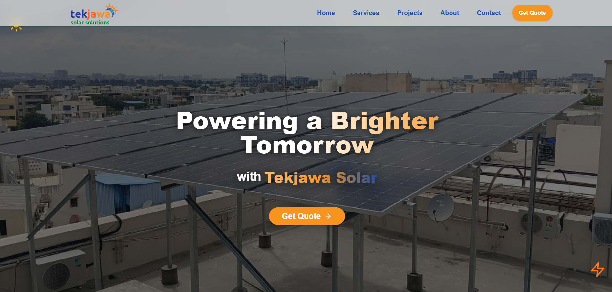
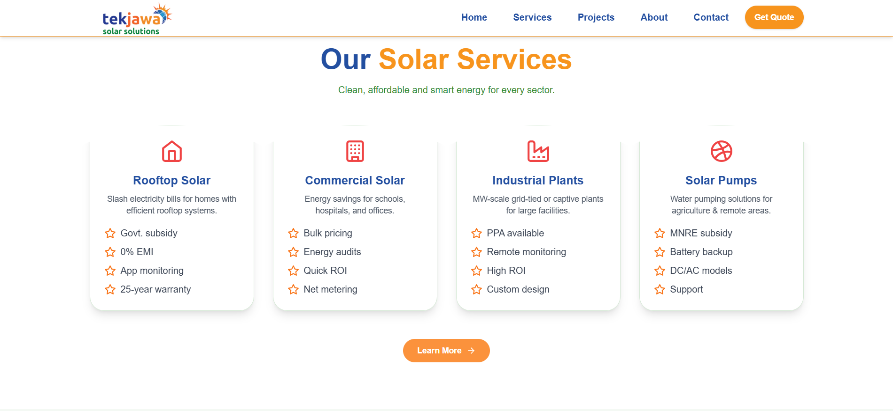
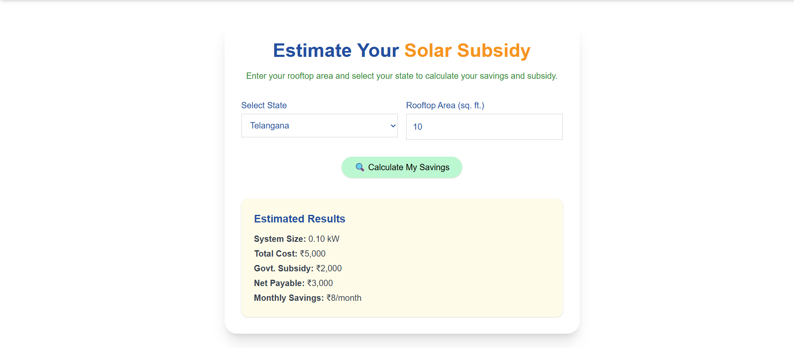
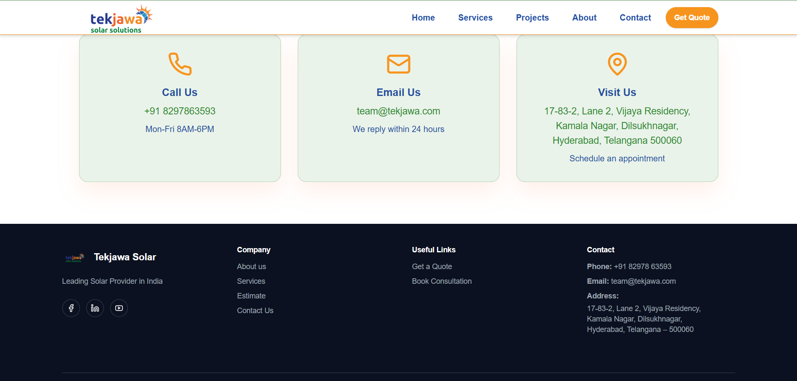

# ☀️ Tekjawa Solar Solutions Website

A modern and responsive solar energy business website developed for **Tekjawa Solar Solutions**. The website provides information about solar services, completed projects, customer testimonials, company advantages, and solar subsidy information through a clean and user-friendly interface.

## 🌐 Project Overview

The Tekjawa Solar Solutions website is a **React-based responsive web application** designed to present solar energy products and services in a professional way.

The website focuses on providing users with an easy way to explore solar solutions, view projects, understand available services, calculate subsidy-related information, and contact the company.

## ✨ Key Features

* 🏠 Modern and responsive home page
* ☀️ Solar energy services section
* 🏗️ Projects showcase
* 🧮 Solar subsidy calculator
* 💬 Customer testimonials
* ⭐ Company advantages section
* 📞 Contact section
* 📚 Learn More page
* 🎥 Solar-related images and videos
* 📱 Mobile-responsive design
* 🧩 Reusable React components
* ⚡ Fast development and build using Vite

## 🛠️ Technologies Used

| Technology   | Purpose                    |
| ------------ | -------------------------- |
| React.js     | Frontend development       |
| JavaScript   | Application logic          |
| Vite         | Development and build tool |
| Tailwind CSS | Styling and responsive UI  |
| HTML5        | Page structure             |
| CSS3         | Custom styling             |
| Git          | Version control            |
| GitHub       | Source code hosting        |

## 📂 Project Structure

```text
tekjawa-website/
│
├── public/
│   ├── Images
│   ├── Videos
│   └── .htaccess
│
├── src/
│   ├── assets/
│   ├── components/
│   │   ├── Layout/
│   │   ├── pages/
│   │   ├── sections/
│   │   └── ui/
│   │
│   ├── lib/
│   ├── App.jsx
│   ├── index.css
│   └── main.jsx
│
├── plugins/
├── tools/
├── index.html
├── package.json
├── package-lock.json
├── tailwind.config.js
├── postcss.config.js
├── vite.config.js
└── README.md
```

## ⚙️ Installation & Setup

### Prerequisites

Make sure you have the following installed:

* Node.js
* npm
* Git

### 1. Clone the repository

```bash
git clone https://github.com/ThotaSamyuktha/tekjawa-website.git
```

### 2. Navigate to the project

```bash
cd tekjawa-website
```

### 3. Install dependencies

```bash
npm install
```

### 4. Start the development server

```bash
npm run dev
```

Vite will provide a local development URL in the terminal.

Open that URL in your browser to view the website.

## 📸 Screenshots

### 🏠 Homepage



### ☀️ Solar Services



### 🧮 Solar Subsidy Calculator



### 📞 Contact & Footer



## 🌍 Live Demo

The live website URL will be added here after deployment.

## 🔮 Future Improvements

* Add backend integration for contact form submissions
* Store customer enquiries in a database
* Add an admin dashboard
* Improve SEO optimization
* Add website analytics
* Add additional solar calculation tools
* Deploy the application to a production environment

## 📚 Learning Outcomes

Through this project, I gained practical experience in:

* Building responsive React applications
* Creating reusable UI components
* Working with Tailwind CSS
* Managing frontend project structure
* Using Vite for modern web development
* Managing source code using Git and GitHub
* Creating user-friendly business websites

## 👩‍💻 Author

**Samyuktha Thota**

B.Tech – Information Technology

GitHub:
https://github.com/ThotaSamyuktha

## 📄 License

This project is created for portfolio and project demonstration purposes.
